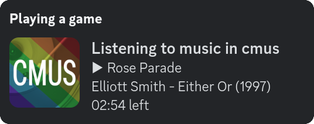

<a name="readme-top"></a>
<div align="center">
	<a href="./LICENSE">
		
	</a>
	<a href="https://github.com/LordOfTrident/cordmus/graphs/contributors">
		
	</a>
	<a href="https://github.com/LordOfTrident/cordmus/stargazers">
		
	</a>
	<a href="https://github.com/LordOfTrident/cordmus/issues">
		
	</a>
	<a href="https://github.com/LordOfTrident/cordmus/pulls">
		
	</a>
	<br><br><br>
	
	<p align="center">🎶 Discord Rich Presence for Cmus written in Nim 🎵</p>
	<p align="center">
		<a href="#demo">View Demo</a>
		·
		<a href="https://github.com/LordOfTrident/cordmus/issues">Report Bug</a>
		·
		<a href="https://github.com/LordOfTrident/cordmus/issues">Request Feature</a>
	</p>
	<br>
</div>

<details>
	<summary>Table of contents</summary>
	<ul>
		<li><a href="#introduction">Introduction</a></li>
		<li><a href="#demo">Demo</a></li>
		<li><a href="#quickstart">Quickstart</a></li>
		<li><a href="#bugs">Bugs</a></li>
	</ul>
</details>

## Introduction
A [Discord Rich Presence](https://discord.com/developers/docs/rich-presence/how-to) client for the
[cmus music player](https://cmus.github.io/) written in [Nim](https://nim-lang.org/).

## Demo
<p align="center">
	
</p>

## Quickstart
```
$ git clone https://github.com/LordOfTrident/cordmus
$ cd cordmus
$ nimble build
$ ./cordmus -h
```

## Bugs
If you find any bugs, please, [create an issue and report them](https://github.com/LordOfTrident/pif/issues).

<br>
<h1></h1>
<br>

<div align="center">
	<a href="https://nim-lang.org/">
		
	</a>
	<p align="center">Made with ❤️ love</p>
</div>

<p align="right">(<a href="#readme-top">Back to top</a>)</p>
